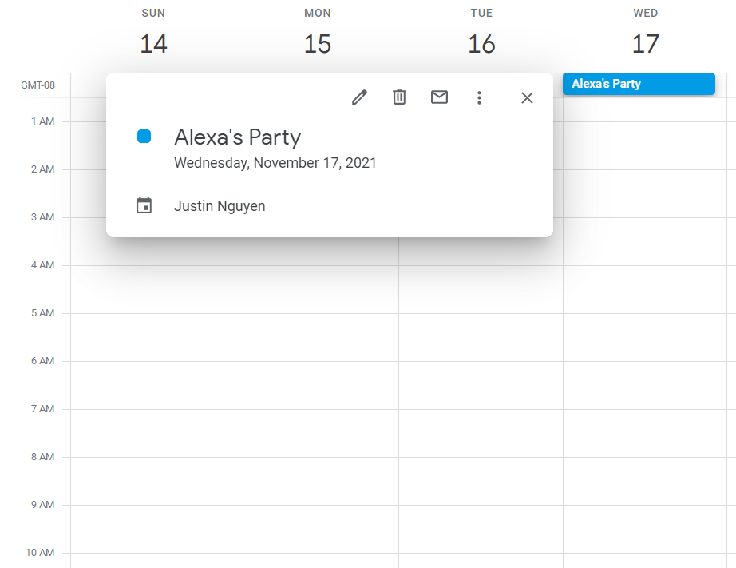
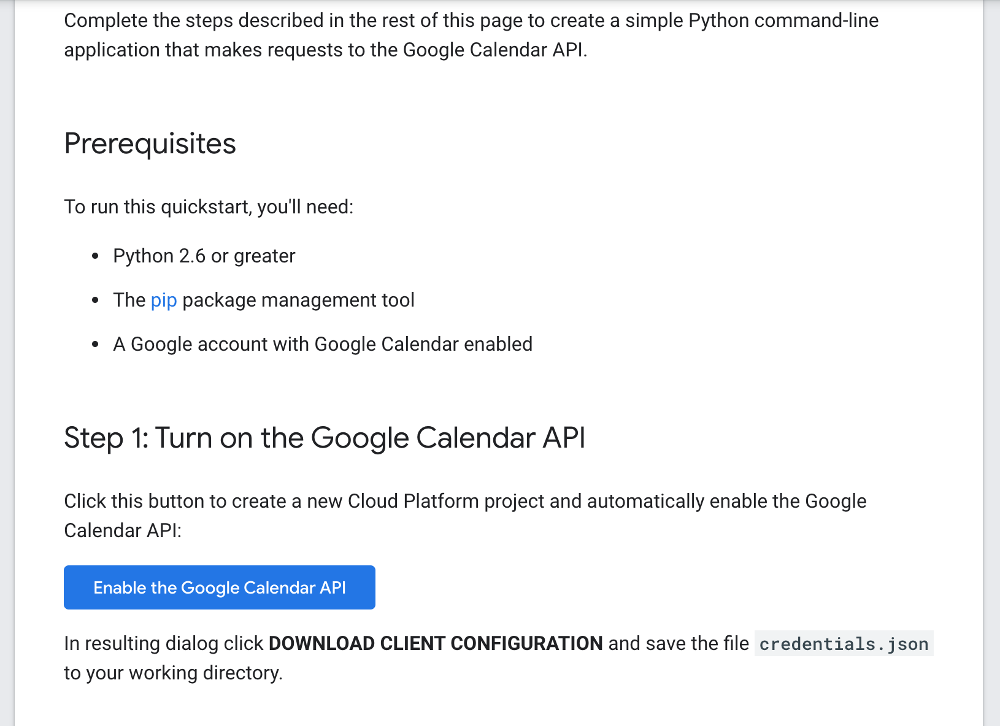
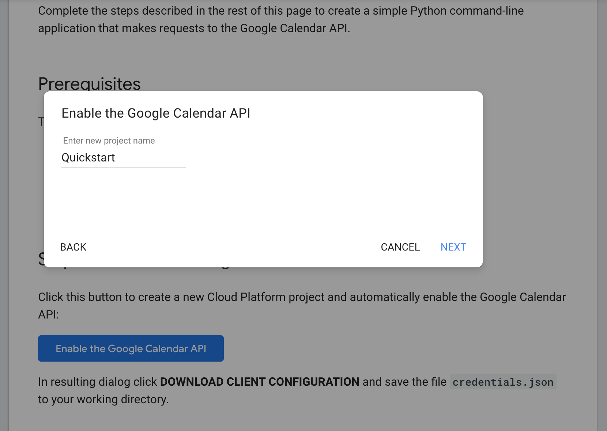
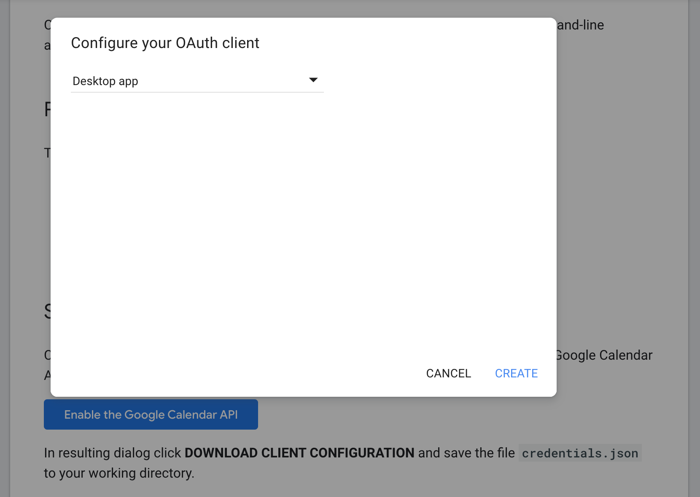

# calendarocr

## What It Does:
Processes images of event information and converts it into a Google Calendar Event.

### How It Works:
- Uses PyTesseract OCR to scan images for a text string
- Identifies the month, day, year, time, and event name from string
- Creates a Google Calendar Event based on this information

### For Example:
Given this image:

 

Calendarocr would read the string **"Alexa's Party: \nNovember 19, \n 2021"**

It would identify the event date to be **November 19, 2021** and the event name as **Alexa's Party**.

A Google Event would be created with the name **Alexa's Party** and date **November 19, 2021**.

 

## How To Install:
First run 

```
git clone insertthisrepositoryhere
```
then install the dependencies by running 
```
pip install -r requirements.txt
```
If you run into issues on GNU/Linux you may have to install the following package: 

- tesseract-ocr

**Additional Steps Before Using:**

First, you need to have a google developer account.

Then, visit this link

https://developers.google.com/calendar/quickstart/python

Click the blue "Enable the Google Calendar API" button. This should automatically set up a the necessary client_id, client_secret, and project_id. 



Choose any name for the project



Select "Desktop App" for Configure Your OAuth CLient




Now download the JSON file by clicking the blue "Download Client Configuration" button.


Place that file in your downloaded repository of calendarOCR.

## How To Use It: 
1. Take a picture of a Calendar Event
2. Crop the picture so such that there is only text and as little background as possible
3. Put the image into the calendarocr folder
4. Execute the following command in the same folder as calendarocr

```
python run.py sampleImage.jpg
```
If you are running calendarocr the first time, you will need to authenticate with Google Sign In first.

### Command Options:

Passing the parameter 0 will keep the image in the folder
```
python3 run.py sampleImage.jpg 0
```

Passing the parameter 1 will delete the image from the folder
```
python3 run.py sampleImage.jpg 1
```
By default run.py keeps the image in the folder if no 2nd parameter is passed

## What to Expect After Running: 
1. A page will open in your default browser, prompting you to choose a Google account that you want to link this application to.
2. Allow the application access to your Google Calendar when prompted, and then close the tab or window. 
3. A message should pop up, saying "Event created", followed by a link of the newly created event.

## Additional Features We Are Working On
- processing a folder of images
- processing mutiple images
- parameters that set the reminder of the event
- recognize start and end time of events
- fix bugs with recognizing incorrect date information
- able to read location of event
- Convert calendarocr to phone app form for easy use
